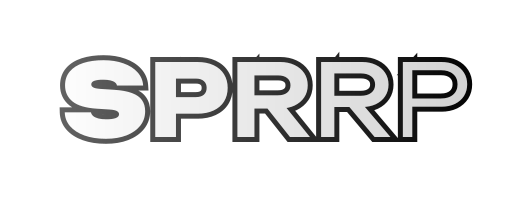

<p align="center">
  <!--<b>SPRRP</b>-->
  
</p>

<p align="center">
  
  
</p>

<p align="center">
  
  
</p>

# Содержание
- [Важное](#важное)
- [Системные требования](#системные-требования)
- [Автоматическое скачивание и установка](#автоматическое-скачивание-и-установка)
- [Ручное скачивание и установка](#ручное-скачивание-и-установка)
- [Дополнительная настройка (необязательно)](#дополнительная-настройка-необязательно)
- [Автоматическое обновление](#автоматическое-обновление)
- [Ручное обновление](#ручное-обновление)

# Важное
## Об установке
Начиная с версии сборки `3.0.2` поддерживается только установка и обновление 
через [Modpack Downloader](https://github.com/devmoded/modpack_downloader) 
с версией не ниже `0.2.2`. 

## О переносе
Сборка была перенесена с версии 1.20.1 на 1.21.1, то есть

```sh
1.20.1 + Fabric => 1.21.1 + Fabric
```

Старую версию можно [посмотреть здесь 👁️](https://github.com/devmoded/SPRRP/tree/v2.3.0), 
а [скачать тут 📥️](https://github.com/devmoded/SPRRP/releases/download/v2.3.0/sprrp-pack.zip)

# Системные требования
Минимальных и рекомендуемых требований нет, так как нет возможности это 
как-либо определить 🤷‍♂️

# Автоматическое скачивание и установка
Для автоматического скачивания сборки можно использовать мою программу 
[Modpack Downloader](https://github.com/devmoded/modpack_downloader)

[📥️ Скачать Modpack Downloader](https://github.com/devmoded/modpack_downloader/releases/latest/download/modpack-downloader-setup.exe)

**Варианты скачивания и установки:**
- Если вы уже скачали Modpack Downloader, то можете ввести в адресной строке 
браузера `modpack-dl://download/sprrp` (🔗) и нажать Enter
- Через графический интерфейс приложения, выбрав `sprrp` в выпадающем списке

Когда вы ввели в адресной строке браузера `modpack-dl://download/sprrp` (🔗)
(и нажали Enter), или выбрали сборку и нажали "Скачать" вам будет необходимо 
выбрать папку с предварительно созданной сборкой (требования указаны вначале) 
начнётся скачивание, а затем выполнится базовая установка.

# Дополнительная настройка (необязательно)
## Автоматическая доп. настройка
Эту настройку можно выполнить либо вручную, как описано ниже, либо 
воспользоваться скриптом [`custom_install.py`](https://github.com/devmoded/SPRRP/blob/main/custom_install.py) (пока не работает)

## Ручная
В основном каталоге есть каталог (папка) `custom/`, внутри три `.zip` архива:

### `emotes (1).zip`
Его необходимо распаковать, и внутри него будут папка `emotes`, её необходимо
поместить в основную папку игры (сборки)

### `Карта.zip`
Его необходимо распаковать, и внутри него будут папка `XaeroWorldMap`(1) и 
файл `xaeroworldmap.txt`(2)

Первый необходимо скопировать в основную папку игры, второй в папку `config/`

### `Миникарта.zip`
Его необходимо распаковать, и внутри него будут папка `XaeroWaypoints`(1) и 
файл `xaerominimap.txt`(2)

Первый необходимо скопировать в основную папку игры, второй в папку `config/`

# Автоматическое обновление
Для автоматического обновления достаточно выполнить один вариантов ниже

**Варианты обновления:**
- Если вы уже скачали Modpack Downloader, то можете ввести в адресной строке 
браузера `modpack-dl://download/sprrp` (🔗) и нажать Enter
- Через графический интерфейс приложения, выбрав `sprrp` в выпадающем списке

<!--
## Доп. настройка внутри игры
### Ресурспаки применять в следующем порядке:
1. `verynicetex`
2. `Деньги_Ver2`
3. `деньги`
4. `Unity-1.16.X-Dark-0.7.0`
-->
